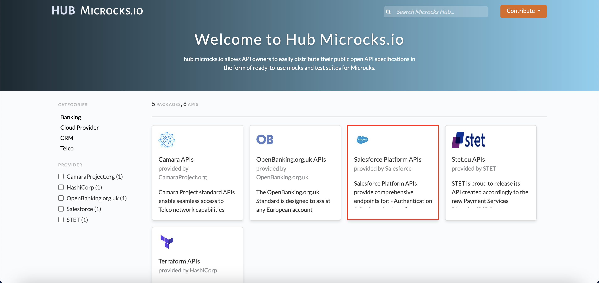

## MICROCKS-MOCKS

This repository contains different artifacts related to MOCK APIs.

### API Mocks

First, artifact is a collection of API mocks for using with [Microcks](https://microcks.io). Microcks is an open source tool for turning your API contract, Postman Collection or SoapUI project into live mocks in seconds.

Our artifact imported into Microcks allows you to access comprehensive, real-world samples on how Salesforce and Twilio API is expected to work. Then it allows you to easily mock-up a instance for your integration tests without "polluting" a real instance.

#### Setup

Once you've got your Microcks instance up-and-running, import .json file of salesforce and twilio API from importers


- URL:```https://github.com/vickybesra/microcks_mocks/blob/main/mocks/twilio_api.json```
- URL:```https://github.com/vickybesra/microcks_mocks/blob/main/mocks/salesforce_api.json```

#### Overview
Once imported into Microcks, you should have the following results with `Mocks URLs` ready to use!


Now, hit the url endpoint to get the response:


New Salesforces mock API package:



Updated the version of industry APIs from 0.1.0-rc(current) to 0.2.1:

https://github.com/user-attachments/assets/9282bd62-aad1-404a-8ce0-7444642e0ea7


